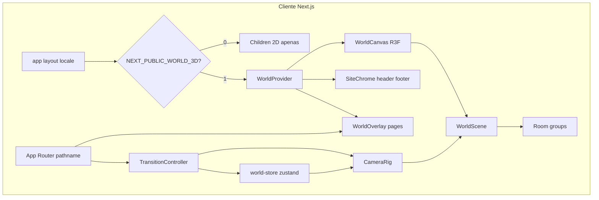

# Arquitetura — mundo 3D

## Diagrama (alto nível)



## Camadas visuais (z-index)

| Ordem | Camada | z-index orientativo |
|-------|--------|---------------------|
| 1 | `WorldCanvas` (WebGL) | 0 |
| 2 | `WorldOverlay` (páginas) | 10 |
| 3 | `SiteChrome` header/footer | 40 |
| 4 | Modais / easter eggs | 50+ |

## Fluxo de navegação

1. Utilizador clica `WorldLink` (ou nav adaptada) para `/work`.
2. `TransitionController` define `phase: exiting` → overlay fade out.
3. `CameraRig` anima para `rooms.work.camera` (zoom ou arco).
4. `router.push('/work')` (prefetch já feito no hover).
5. Overlay novo fade in → `phase: idle` → foco no `h1`.

**Deep link (primeira carga):** pathname → `roomId` → câmara sem animação longa (≤400ms) ou instantânea.

## Estrutura de pastas (alvo)

```text
components/world/
  WorldCanvas.tsx          # dynamic ssr:false
  WorldScene.tsx
  CameraRig.tsx
  TransitionController.tsx
  WebGLErrorBoundary.tsx
  rooms/
    RoomHome.tsx
    RoomWork.tsx
    RoomFlow.tsx
    RoomLab.tsx
  ui/
    WorldLink.tsx
    WorldNavBridge.tsx
stores/
  world-store.ts
world/
  rooms.ts                 # config declarativa
  types.ts
  constants.ts
hooks/
  useWorldNavigate.ts
  useWorldRoomFromPath.ts
  useWebGLAvailable.ts
  useWorldQuality.ts
backgrounds/               # REMOVER na Fase 0
docs/3d-world/             # esta documentação
```

## Tipos principais (`world/types.ts`)

```ts
type RoomId = "home" | "work" | "flow" | "lab" | "contact";

type TransitionStyle = "zoom" | "arc";

type RoomConfig = {
  id: RoomId;
  paths: string[];           // "/", "/work", "/pt/work", …
  camera: {
    position: [number, number, number];
    target: [number, number, number];
    fov?: number;
  };
  transition: {
    durationMs: number;
    style: TransitionStyle;
  };
  overlay: {
    fadeOutMs: number;
    fadeInMs: number;
    enterDelayMs: number;
  };
};
```

## Estado global (`world-store`)

| Campo | Tipo | Descrição |
|-------|------|-----------|
| `currentRoomId` | `RoomId` | Sala visível |
| `phase` | `idle \| exiting \| traveling \| entering` | Máquina de estados |
| `quality` | `low \| high` | Perfil gráfico |
| `motion` | `full \| reduced` | De `prefers-reduced-motion` |
| `webgl` | `unknown \| ok \| failed` | Deteção |

## Integração com existente

| Módulo atual | Comportamento com 3D |
|--------------|----------------------|
| `next-intl` | Overlay continua traduzido; meshes sem copy na v1 |
| `ThemeProvider` | Atualiza cores de luzes/névoa no `WorldScene` |
| `ProfileFlowTimeline` | Conteúdo no overlay; sala `flow` = cenário |
| `messages/*.json` | Fonte única de texto |
| `flow-page` overlay | Mantém leitura calma por cima do WebGL |

## Fallback 2D

Condições para **não montar** `WorldCanvas`:

- `NEXT_PUBLIC_WORLD_3D !== "1"`
- `useWebGLAvailable() === false`
- `prefers-reduced-motion: reduce` (configurável — ver D2)
- Cookie/localStorage `world-mode=classic`

Renderizar árvore atual sem `WorldProvider`.

## Performance (diretrizes)

- `dpr={[1, 1.5]}` — cap em mobile.
- `frameloop="demand"` quando idle (Fase 5).
- Lazy load por sala (`React.lazy` nos grupos).
- Post-processing e sombras só em `quality: high`.

## Segurança e SEO

- Conteúdo indexável permanece no **HTML do overlay** (RSC/SSG como hoje).
- Canvas é progress enhancement; meta tags por rota inalteradas.

## Referências

- [React Three Fiber](https://docs.pmnd.rs/react-three-fiber)
- [DECISIONS.md](./DECISIONS.md)
- [ROADMAP.md](./ROADMAP.md)
